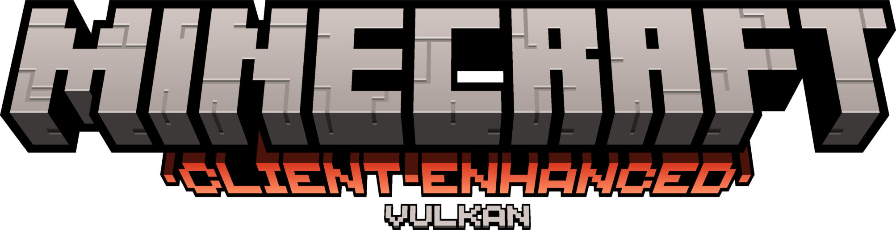
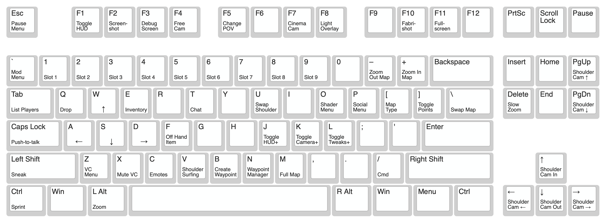
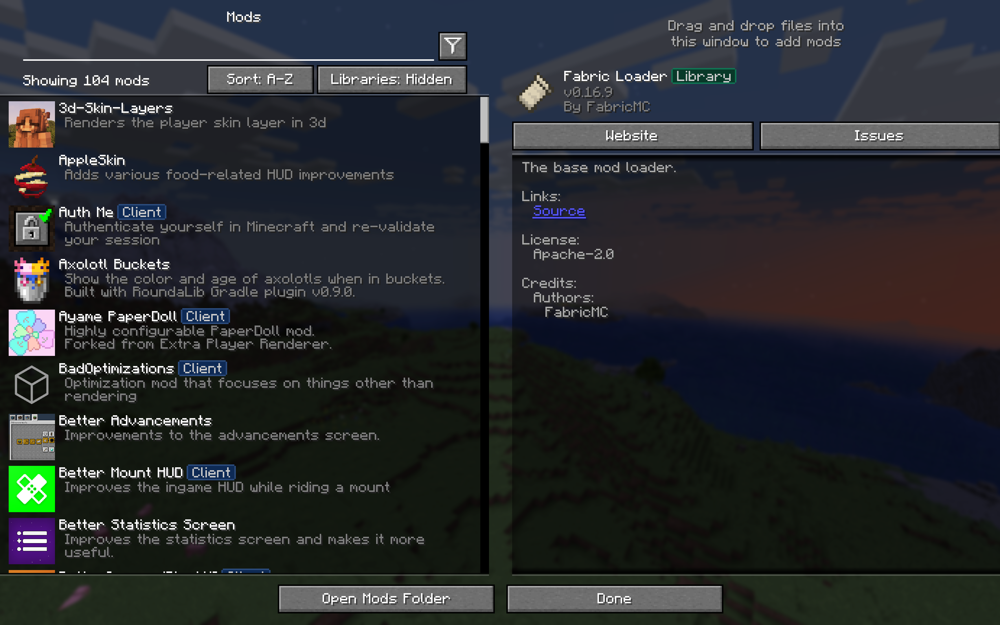

<h3 align="center" >
  <!--
  mods color: #1998ca
  fabric color: #dbb69b
  modrinth color: #1bd96a
  github color: brightgreen
  sodium color: #83cc72
  minecraft color: #00AA00
  label color: #505050
  discord color: #5865F2
  mastodon color: #6364FF
  -->

  <div>
    <!-- <a href="https://modrinth.com/modpack/client-enhanced"></a> -->
    <a href="https://github.com/nickesc/client-enhanced"></a>
    <a href="https://github.com/nickesc/client-enhanced"></a>
  </div>
  <br>
  
  <h3 align="center">
    Minecraft <code>Client-Enhanced</code> Modpack
  </h3>
  
  <h6 align="center">
    by <a href="https://nickesc.github.io">N. Escobar</a> / <a href="https://github.com/nickesc">nickesc</a>
    <br><br>
    <a href="https://infosec.exchange/@nickesc"></a>
  </h6>
  <h6 align="center">
    a client-side Minecraft modpack that aims<br>
    to overhaul and modernize the experience
  </h6>
  <div align="center">
    <a href="https://www.minecraft.net/en-us/about-minecraft"></a>
    <a href="https://github.com/nickesc/client-enhanced/tree/main/mods"></a>
    <br>
    <a href="https://fabricmc.net/"></a>
    <a href="https://modrinth.com/mod/sodium"></a>
  </div>
</h3>

## Overview


`Client-Enhanced` is an overhaul of the current Minecraft client.

Mods like [Camera Overhaul](https://modrinth.com/mod/cameraoverhaul) and [Shoulder Surfing Reloaded](https://modrinth.com/mod/shoulder-surfing-reloaded) update the way it feels to move around and the way the camera controls. 

And mods like [Sodium](https://modrinth.com/mod/sodium) and [Lithium](https://modrinth.com/mod/lithium) are used to optimize the experience for all kinds of hardware (with the addition of a version of the modpack [made for the Vulkan renderer](#vulkan-version)). 

The pack also includes mods like [Roughly Enough Resources](https://modrinth.com/mod/rei) and [JourneyMap](https://modrinth.com/mod/journeymap) that add common-sense UI elements like item/recipe lookup and a minimap. 

Resource packs like [3D Default](https://modrinth.com/resourcepack/3d-default) and [Fresh Animations](https://modrinth.com/resourcepack/fresh-animations) are also used to add 3D detail to models and revamp animations.

Shaders like [MakeUp - Ultra Fast](https://modrinth.com/shader/makeup-ultra-fast-shaders) and [LITE Shaders](https://modrinth.com/shader/lite-shaders) are able to breath new life into the visuals and make the world look much more impressive through [Iris](https://modrinth.com/mod/iris) while maintaining reasonable framerates.

[](client-enhanced/img/load-in/load-in.mp4)
> Click the `.gif` to see shader load-in in realtime and full resolution

> [!CAUTION]
> `Client-Enhanced` is not necessarily compatible with multiplayer servers just because it is client-side only! Some of the mods included may be detected by anti-cheat plugins. 
> 
> ***DO NOT*** connect to a server while using `Client-Enhanced` unless you know that the mods in this modpack are permitted on that server.

#### Other notable features:
- Client side only
- Connect to older Minecraft servers
- Host LAN worlds online and let other players connect from anywhere
- Controller support
- Improved player HUD
  - Enemy health bars
  - Block ID for everything you look at
  - A dynamic crosshair
  - Armor status
  - More...
- Improved chat UI
- Item location/chest tracking
- Inventory sorting
- Container previews
- New Statistics and Advancements screens
- Built in resource pack, shader pack and world download browsers
- Dynamic lighting for held and dropped items
- Updated Elytra flight controls
- A zoom button
- Tweaks to how player animations, skins and capes are rendered
- New particle effects and particle physics
- New sounds and a reworked, more realistic sound engine
- Other fixes and tweaks to controls

See the [Mod List](#mod-list) for a full list of the included mods.

<details>
  <summary><h3> Optional Features </h4></summary>

##### Resource Packs
Included in the resource packs are a number of vanilla-adjacent updates to mob models and animations. These are disabled by default, but can be enabled if you want. Make sure they are at the top of the resource pack list if you want to use them. They may impact performance significantly.

There are also additional optional 3D model/effect packs that can be enabled to add further dimension to the world.

There are also alternatives to the container GUI replacements that can be enabled as resource packs instead of Colorful Containers.

##### Shaders
There are a lot of different options for shaders in the Shader Pack menu. To access that menu, press `O`. By default, the [LITE Shaders](https://modrinth.com/shader/lite-shaders) shader is selected, but there are also options for higher end machines and lower end machines.

##### Hotkeys
Many of the enhancements included in this modpack can be toggled using hotkeys:

- Pressing `K` will toggle camera changes, including shaders and particle physics
- Pressing `J` will toggle many HUD elements, including the minimap, armor HUD and block ID
- Pressing `L` will toggle a couple backend changes like sign click-through and some render culling

</details>

## Installation

The `Client-Enhanced` modpack is released on GitHub as a `.mrpack` file that can be imported into the Modrinth App to add the modpack configuration as a new instance.

### Requirements:
- Minecraft 1.21.4
- the [Modrinth App](https://modrinth.com/app) installed
- macOS **(untested on other platforms)**

### Instructions

1. Choose your modpack version:

#### `Main` version:
> The complete, fully featured modpack. Includes all enhancements, fixes and tweaks to the client.
>
> Runs on the Sodium rendering engine. Shaders are supported and enabled by default. Requires more powerful hardware to maintain a steady framerate.

#### `Vulkan` Version:
> ###### [View the Vulkan branch of the repository](https://github.com/nickesc/client-enhanced/tree/vulkan)
> 
> A lightweight version of the modpack made to run with a Vulkan renderer. Any mods that conflict with [VulkanMod](https://modrinth.com/mod/vulkanmod) have been removed.
>
> Delivers **significant** performance boosts on some systems, but **does not have shader support**, among other compromises. Should be capable of running on any hardware.
> 
> <details> 
>   <summary><h4>Vulkan Only Mods</h4></summary>
>
> Mod | Link
> -|-|
> VulkanMod | [Modrinth](https://modrinth.com/mod/vulkanmod)
> FPS Reducer | [Modrinth](https://modrinth.com/mod/fps-reducer)
> LambDynamicLights | [Modrinth](https://modrinth.com/mod/lambdynamiclights)
> 
> </details>

2. Download the chosen version of the `Client-Enhanced` `.mrpack` file from the [latest Release](https://github.com/nickesc/client-enhanced/releases/latest)
3. In the Modrinth App, click the `+` icon in the left sidebar to create a new instance and select `From File`
4. Select `Import from file` and open the `.mrpack` file you downloaded
5. Allow the modpack to download
6. Press `Play` to launch Minecraft

<!--### Updating

To update either version of the modpack, execute the following command in the terminal from the modpack's directory:
```
git pull
```

> [!NOTE]
> Some settings changed by the user may be overwritten during modpack updates -- make backups of your `options.txt` file and `config/` folder if you want to make sure your settings stay the same as they were before the update.
>
> Keep in mind that updated settings are supposed to make the experience better and more enjoyable, especially if new mods are added to the pack.-->

## Default Keybindings



## Mod List



> *\* = not included in the Vulkan version of the modpack*

<details> 
  <summary><h4>Libraries</h4></summary>
  
Mod | Link
-|-|
Fabric API | [Modrinth]()
Cloth Config API | [Modrinth](https://modrinth.com/mod/cloth-config)
Mod Menu | [Modrinth](https://modrinth.com/mod/modmenu)
Yet Another Config Lib | [Modrinth](https://modrinth.com/mod/yacl)
Fabric Language Kotlin | [Modrinth](https://modrinth.com/mod/fabric-language-kotlin)
ukulib | [Modrinth](https://modrinth.com/mod/ukulib)
Collective | [Modrinth](https://modrinth.com/mod/collective)
libIPN | [Modrinth](https://modrinth.com/mod/libipn)
Architechtury API | [Modrinth](https://modrinth.com/mod/architectury-api)
UniLib | [Modrinth](https://modrinth.com/mod/unilib)
Balm | [Modrinth](https://modrinth.com/mod/balm)
CICADA | [Modrinth](https://modrinth.com/mod/cicada)
SuperMartijn642's Config Lib | [Modrinth](https://modrinth.com/mod/supermartijn642s-config-lib)
Konkrete | [Modrinth](https://modrinth.com/mod/konkrete)
Melody | [Modrinth](https://modrinth.com/mod/melody)
TCDCommons API | [Modrinth](https://modrinth.com/mod/tcdcommons)
M.R.U | [Modrinth](https://modrinth.com/mod/mru)
Forge Config API Port | [Modrinth](https://modrinth.com/mod/forge-config-api-port)
oωo (owo-lib) | [Modrinth](https://modrinth.com/mod/owo-lib)
TxniLib | [Modrinth](https://modrinth.com/mod/txnilib)
Searchables | [Modrinth](https://modrinth.com/mod/searchables)

</details>

<details> 
  <summary><h4>Optimization</h4></summary>

##### General

Mod | Link
-|-|
Lithium | [Modrinth](https://modrinth.com/mod/lithium)
Ferrite Core | [Modrinth](https://modrinth.com/mod/ferrite-core)
Concurrent Chunk Management Engine | [Modrinth](https://modrinth.com/mod/c2me-fabric)
Modern Fix | [Modrinth](https://modrinth.com/mod/modernfix)
Bad Optimizations | [Modrinth](https://modrinth.com/mod/badoptimizations)
*Dynamic FPS** | [Modrinth](https://modrinth.com/mod/dynamic-fps)
Language Reload | [Modrinth](https://modrinth.com/mod/language-reload)

##### Networking

Mod | Link
-|-|
Krypton | [Modrinth](https://modrinth.com/mod/krypton)
Bad Packets | [Modrinth](https://modrinth.com/mod/badpackets)

##### Visual

Mod | Link
-|-|
*Sodium** | [Modrinth](https://modrinth.com/mod/sodium)
*Sodium Extra** | [Modrinth](https://modrinth.com/mod/sodium-extra)
*Reese's Sodium Options** | [Modrinth](https://modrinth.com/mod/reeses-sodium-options)
*Sodium Options API** | [Modrinth](https://modrinth.com/mod/sodium-options-api)
*Sodium Options Mod Compat** | [Modrinth](https://modrinth.com/mod/sodium-options-mod-compat)
ImmediatelyFast | [Modrinth](https://modrinth.com/mod/immediatelyfast)
Entity Culling | [Modrinth](https://modrinth.com/mod/entityculling)
More Culling | [Modrinth](https://modrinth.com/mod/moreculling)

</details>

<details> 
  <summary><h4>Fixes</h4></summary>
  
Mod | Link
-|-|
Debugify | [Modrinth](https://modrinth.com/mod/debugify) 
Shift-Scroll Fix for macOS | [Modrinth](https://modrinth.com/mod/shift-scroll-fix)
No Resource Pack Warnings | [Modrinth](https://modrinth.com/mod/no-resource-pack-warnings)
Yeetus Experimentus | [Modrinth](https://modrinth.com/mod/yeetus-experimentus)
Axolotl Buckets | [Modrinth](https://modrinth.com/mod/axolotl-buckets)
Better Shields | [Modrinth](https://modrinth.com/mod/bettershields)
Fast IP Ping | [Modrinth](https://modrinth.com/mod/fast-ip-ping)
No Telemetry | [Modrinth](https://modrinth.com/mod/no-telemetry)
GPUTape | [Modrinth](https://modrinth.com/mod/gputape)

</details>

<details> 
  <summary><h4>UI</h4></summary>
  
##### HUD

Mod | Link
-|-|
Jade | [Modrinth](https://modrinth.com/mod/jade)
JourneyMap | [Modrinth](https://modrinth.com/mod/journeymap)
JourneyMap Web Map | [Modrinth](https://modrinth.com/mod/journeymap-web-map)
Ayame PaperDoll | [Modrinth](https://modrinth.com/mod/ayame-paperdoll)
uku's Armor HUD | [Modrinth](https://modrinth.com/mod/ukus-armor-hud)
Dynamic Crosshair | [Modrinth](https://modrinth.com/mod/dynamiccrosshair)
Appleskin | [Modrinth](https://modrinth.com/mod/appleskin)
Detail Armor Bar | [Modrinth](https://modrinth.com/mod/detail-armor-bar)
Better Mount HUD | [Modrinth](https://modrinth.com/mod/better-mount-hud)
Raised | [Modrinth](https://modrinth.com/mod/raised)
Chest Tracker | [Modrinth](https://modrinth.com/mod/chest-tracker)
Health Indicators | [Modrinth](https://modrinth.com/mod/health-indicators)
Provi's Health Bars | [Modrinth](https://modrinth.com/mod/provis-health-bars)
What Did I Just Kill? | [Modrinth](https://modrinth.com/mod/what-did-i-just-kill)
Status Effect Bars | [Modrinth](https://modrinth.com/mod/status-effect-bars)
Current Music Track | [Modrinth](https://modrinth.com/mod/current-game-music-track)
Better Ping Display | [Modrinth](https://modrinth.com/mod/better-ping-display-fabric)
Colorful Subtitles | [Modrinth](https://modrinth.com/mod/colorful-subtitles)
Toggle Subtitles | [Modrinth](https://modrinth.com/mod/toggle-subtitles)

##### Inventory

Mod | Link
-|-|
Roughly Enough Resources | [Modrinth](https://modrinth.com/mod/rei)
Just Enough Breeding | [Modrinth](https://modrinth.com/mod/justenoughbreeding)
Inventory Profiles Next | [Modrinth](https://modrinth.com/mod/inventory-profiles-next)
Peek | [Modrinth](https://modrinth.com/mod/peek)
Durability Tooltip | [Modrinth](https://modrinth.com/mod/durability-tooltip)
Persistent Inventory Search | [Modrinth](https://modrinth.com/mod/persistent-inventory-search)

##### Chat

Mod | Link
-|-|
Chat Patches | [Modrinth](https://modrinth.com/mod/chatpatches)
Chat Notify | [Modrinth](https://modrinth.com/mod/chatnotify)
Chat Heads | [Modrinth](https://modrinth.com/mod/chat-heads)
Chat Animation | [Modrinth](https://modrinth.com/mod/chatanimation)
Chat Signing Hider | [Modrinth](https://modrinth.com/mod/chat-signing-hider)

##### Window

Mod | Link
-|-|
FancyMenu | [Modrinth](https://modrinth.com/mod/fancymenu)
Dark Loading Screen | [Modrinth](https://modrinth.com/mod/dark-loading-screen)
Resourcify | [Modrinth](https://modrinth.com/mod/resourcify)
Better Statistics Screen | [Modrinth](https://modrinth.com/mod/better-stats/gallery)
Better Advancements | [Modrinth](https://modrinth.com/mod/better-advancements)
Better Command Block UI | [Modrinth](https://modrinth.com/mod/bettercommandblockui)
BetterF3 | [Modrinth](https://modrinth.com/mod/betterf3)
Blur+ | [Modrinth](https://modrinth.com/mod/blur-plus)
Server Country Flags | [Modrinth](https://modrinth.com/mod/server-country-flags)
World Play Time | [Modrinth](https://modrinth.com/mod/world-play-time)
Cursor Anchor | [Modrinth](https://modrinth.com/mod/cursor-anchor)
Smooth Scrolling | [Modrinth](https://modrinth.com/mod/smooth-scroll)
*Cubes Without Borders** | [Modrinth](https://modrinth.com/mod/cubes-without-borders)

</details>

<details> 
  <summary><h4>Enhancements</h4></summary>
  
##### Player

Mod | Link
-|-|
Not Enough Animations | [Modrinth](https://modrinth.com/mod/not-enough-animations)
3D Skin Layers | [Modrinth](https://modrinth.com/mod/3dskinlayers)
Wavey Capes | [Modrinth](https://modrinth.com/mod/wavey-capes)
Capes | [Modrinth](https://modrinth.com/mod/capes)
*YDM's Weapon Master** | [Modrinth](https://modrinth.com/mod/weaponmaster)

##### Camera

Mod | Link
-|-|
Camera Overhaul | [Modrinth](https://modrinth.com/mod/cameraoverhaul)
Shoulder Surfing Reloaded | [Modrinth](https://modrinth.com/mod/shoulder-surfing-reloaded)
First-person Model | [Modrinth](https://modrinth.com/mod/first-person-model)
Do a Barrel Roll | [Modrinth](https://modrinth.com/mod/do-a-barrel-roll)
DeathView | [Modrinth](https://modrinth.com/mod/deathview)
Full Brightness Toggle | [Modrinth](https://modrinth.com/mod/full-brightness-toggle)
Zoomify | [Modrinth](https://modrinth.com/mod/zoomify)
*Fabrishot** | [Modrinth](https://modrinth.com/mod/fabrishot)

##### Visual

Mod | Link
-|-|
*Physics Mod** | [Modrinth](https://modrinth.com/mod/physicsmod)
Visuality | [Modrinth](https://modrinth.com/mod/visuality)
Particular | [Modrinth](https://modrinth.com/mod/particular)
Falling Leaves | [Modrinth](https://modrinth.com/mod/fallingleaves)
Make Bubbles Pop | [Modrinth](https://modrinth.com/mod/make_bubbles_pop)
Fog | [Modrinth](https://modrinth.com/mod/fog)
*Explosive Enhancement** | [Modrinth](https://modrinth.com/mod/explosive-enhancement)
*Chunks Fade In** | [Modrinth](https://modrinth.com/mod/chunks-fade-in)
cat_jam | [Modrinth](https://modrinth.com/mod/cat_jam)

##### Optifine Alternatives

Mod | Link
-|-|
*Puzzle** | [Modrinth](https://modrinth.com/mod/puzzle)
*Iris** | [Modrinth](https://modrinth.com/mod/iris)
Entity Texture Features | [Modrinth](https://modrinth.com/mod/entitytexturefeatures)
Entity Model Features | [Modrinth](https://modrinth.com/mod/entity-model-features)
Continuity | [Modrinth](https://modrinth.com/mod/continuity)
OptiGUI | [Modrinth](https://modrinth.com/mod/optigui)
Sodium Dynamic Lights | [Modrinth](https://modrinth.com/mod/sodium-dynamic-lights)
Capes | [Modrinth](https://modrinth.com/mod/capes)

##### Sound

Mod | Link
-|-|
Sound Physics Remastered | [Modrinth](https://modrinth.com/mod/sound-physics-remastered)
Sounds | [Modrinth](https://modrinth.com/mod/sound)
Sound Controller | [Modrinth](https://modrinth.com/mod/sound-controller)
Pling | [Modrinth](https://modrinth.com/mod/pling)

##### Controls

Mod | Link
-|-|
Controlify | [Modrinth](https://modrinth.com/mod/controlify)
ClickThrough Plus | [Modrinth](https://modrinth.com/mod/clickthrough+)
Client Tweaks | [Modrinth](https://modrinth.com/mod/client-tweaks)
Mouse Tweaks | [Modrinth](https://modrinth.com/mod/mouse-tweaks)

##### Commands

Mod | Link
-|-|
Mods Command | [Modrinth](https://modrinth.com/mod/searchables)
Simple Item Editor | [Modrinth](https://modrinth.com/mod/simple-item-editor)
Simple Update Checker | [Modrinth](https://modrinth.com/mod/simple-update-checker)

##### Client

Mod | Link
-|-|
e4mc | [Modrinth](https://modrinth.com/mod/e4mc)
Custom LAN | [Modrinth](https://modrinth.com/mod/custom-lan)
ViaFabricPlus | [Modrinth](https://modrinth.com/mod/viafabricplus)
Auth Me | [Modrinth](https://modrinth.com/mod/auth-me)
No Chat Reports | [Modrinth](https://modrinth.com/mod/no-chat-reports)
Not Enough Crashes | [Modrinth](https://modrinth.com/mod/notenoughcrashes)
Too Many Shortcuts | [Modrinth](https://modrinth.com/mod/too-many-shortcuts)
Screenshot Organization | [Modrinth](https://modrinth.com/mod/screenshot-organisation)
CraftPresence | [Modrinth](https://modrinth.com/mod/craftpresence)

</details>

## Add-on Packs

<details> 
  <summary><h4>Resource Packs</h4></summary>

##### 3D Models

Pack | Link
-|-|
3D Default | [Modrinth](https://modrinth.com/resourcepack/3d-default)
3D Models (UltiCraft Sandalone) | [Modrinth](https://modrinth.com/resourcepack/ulticraft-models-3d)
Farm 3D | [Modrinth](https://modrinth.com/resourcepack/farm-3d)
Rounded Trees | [Modrinth](https://modrinth.com/resourcepack/round-trees)
Cubic Sun and Moon | [Modrinth](https://modrinth.com/resourcepack/cubic-sun-moon)
Better Leaves | [Modrinth](https://modrinth.com/resourcepack/betterleaves)
Blue's Better Monsters | [CurseForge](https://www.curseforge.com/minecraft/texture-packs/blues-better-monsters)
Duck Chicken Goose | [CurseForge](https://www.curseforge.com/minecraft/texture-packs/allfowl)
Better Cats | [CurseForge](https://www.curseforge.com/minecraft/texture-packs/better-cats-minecraft)
Better Rabbits | [CurseForge](https://www.curseforge.com/minecraft/texture-packs/better-rabbits)
Better Pigs | [CurseForge](https://www.curseforge.com/minecraft/texture-packs/better-pigs)
Better Wolves | [CurseForge](https://www.curseforge.com/minecraft/texture-packs/better-wolves)

##### Animations

Pack | Link
-|-|
Fresh Animations | [Modrinth](https://modrinth.com/resourcepack/fresh-animations)
Fresh Animations - Extensions | [Modrinth](https://modrinth.com/resourcepack/fresh-animations-extensions)
Better Flame Particles | [Modrinth](https://modrinth.com/resourcepack/better-flame-particles)

##### GUI

Pack | Link
-|-|
Colorful Containers GUI | [Modrinth](https://modrinth.com/resourcepack/colourful-containers-gui)
Recolorful Containers | [Modrinth](https://modrinth.com/resourcepack/recolourful-containers-gui/)
Unique Dark | [Modrinth](https://modrinth.com/resourcepack/unique-dark)
Low Shield | [Modrinth](https://modrinth.com/resourcepack/low-shield-pack)
Low On Fire | [Modrinth](https://modrinth.com/resourcepack/low-on-fire)
Rybo's Enhanced GUI | [Planet Minecraft](https://www.planetminecraft.com/texture-pack/rybo-s-enhanced-gui/)
Caves & Cliffs Panorama | [CurseForge](https://www.curseforge.com/minecraft/texture-packs/the-1-18-panorama)

##### CTM

Pack | Link
-|-|
CTM Overhaul | [Modrinth]()
It's All Connected | [Modrinth](https://modrinth.com/resourcepack/its-all-connected)

</details>

<details> 
  <summary><h4>Shader Packs</h4></summary>
  
Pack | Link
-|-|
MakeUp - Ultra Fast | [Modrinth](https://modrinth.com/shader/makeup-ultra-fast-shaders)
LITE Shaders | [Modrinth](https://modrinth.com/shader/lite-shaders)
Super Duper Vanilla | [Modrinth](https://modrinth.com/shader/super-duper-vanilla)
Bloop Shaders | [Modrinth](https://modrinth.com/shader/bloop-shaders)
BSL Shaders | [Modrinth](https://modrinth.com/shader/bsl-shaders)
BSL Shaders - Classic | [Modrinth](https://modrinth.com/shader/bsl-shaders-classic)
Complementary Shaders - Unbound | [Modrinth](https://modrinth.com/shader/complementary-unbound)
Complementary Shaders - Reignited | [Modrinth](https://modrinth.com/shader/complementary-reimagined)
Euphoria Patches | [Modrinth](https://modrinth.com/mod/euphoria-patches)
Mellow | [Modrinth](https://modrinth.com/shader/mellow)
Miniature Shader | [Modrinth](https://modrinth.com/shader/miniature-shader)
Licorice Shaders | [Modrinth](https://modrinth.com/shader/liquorice)
Open4ES Renewed | [Modrinth](https://modrinth.com/shader/open4es-renewed)
Simply Upscaled | [Modrinth](https://modrinth.com/shader/simply-upscaled)
Vanilletix Reimagined | [Modrinth](https://modrinth.com/shader/vanilletix)
CH Motion | [Modrinth](https://modrinth.com/shader/ch-motion)
DepthField | [Modrinth](https://modrinth.com/shader/depthfield)

</details>

<!--
## Development:
Development steps are the same as installation until choosing a version.

Instead, clone the repository and install Physics as normal:
```sh
git https://github.com/nickesc/client-enhanced && \
  client-enhanced/scripts/download-physics.sh
```

To work on the Vulkan branch:
```sh
git checkout vulkan
```

And to change back to the Main branch:
```sh
git checkout main && \
  client-enhanced/scripts/download-physics.sh
```

Then proceed with installation instructions.
-->

## Stats
<!--<a href="https://github.com/nickesc/client-enhanced"></a>-->
<a href="https://github.com/nickesc/client-enhanced/releases"></a>
<a href="https://github.com/nickesc/client-enhanced"></a>
<a href="https://github.com/nickesc/client-enhanced"></a>

<!--<a href="https://modrinth.com/modpack/client-enhanced"></a>
<a href="https://modrinth.com/modpack/client-enhanced/versions"></a>-->


