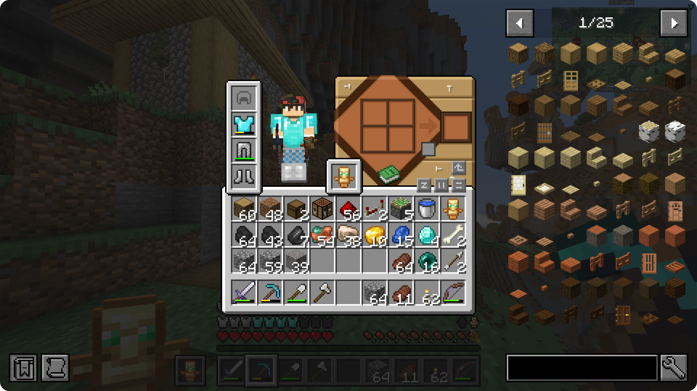
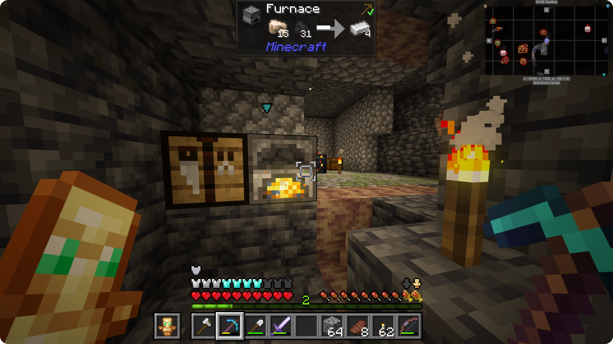
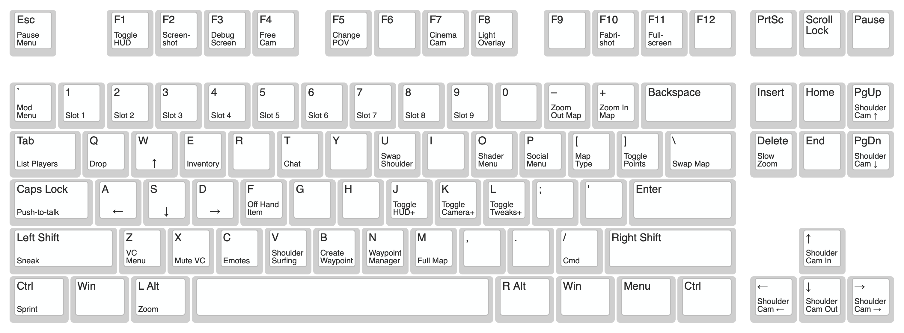

  
  
  

 

  <h1 align="center">
    
  </h1>
  

    by nickesc — <a href="https://github.com/nickesc">GitHub</a> | <a href="https://modrinth.com/user/nickesc">Modrinth</a>
  

## Overview

**_Client-Enhanced_** is an overhaul of the current Minecraft client. Its goal is to keep the game feeling as close to Vanilla as possible while adding a number of improvements, enhancements and upgrades designed to improve quality of life, visuals, performance, multiplayer, and more.

When you play with **_Client-Enhanced_**, you will only be playing with client-side mods. This means there are no blocks or items added to the game, and no significant additions to the game's mechanics or gameplay. Using this modpack, you should be able to play on any Vanilla server.

Instead, this modpack focuses on improving the way the game looks and feels.

  

 

> **Caution: Always check server rules before connecting**
>
> **_Client-Enhanced_** is not necessarily compatible with multiplayer servers even though it is client-side only. Some of the mods included may be flagged by anti-cheat plugins and result in a ban.
>
> **_DO NOT_** connect to a server with **_Client-Enhanced_** unless you know that the mods in this modpack are permitted on that server.

Below is a list of many of the major features and improvements included in **_Client-Enhanced_**, but it is not exhaustive. For a full list of included content, see the [Mod List](/mods/README.md), [Shader Pack List](/shaderpacks/README.md) and [Resource Pack List](/resourcepacks/README.md).

### Visuals

Shaders are supported through [Iris](https://modrinth.com/mod/iris), with [I Like Vanilla](https://modrinth.com/shader/i-like-vanilla) as the default, which overhauls lighting, shadows, and atmosphere while still looking like the Minecraft you know and love.

[Camera Overhaul](https://modrinth.com/mod/cameraoverhaul) adds weight and movement to the camera, so it tilts, sways, and bobs as you move. [Shoulder Surfing Reloaded](https://modrinth.com/mod/shoulder-surfing-reloaded) reworks third-person into a proper over-the-shoulder perspective you can actually play in. Also available is a freecam perspective, allowing you to detach the camera for a free-roaming perspective.

Effects and particles have been improved throughout, with tons of new and improved particle effects for blocks, entities, interactions and more. Player skin and cape rendering have also been updated to be more dynamic and three-dimensional, and new player animations have also been added for first- and third-person views.

Resource packs like [Nautilus 3D](https://modrinth.com/resourcepack/nautilus3d) and [Fresh Animations](https://modrinth.com/resourcepack/fresh-animations) add 3D detail to block models and give other entities more expressive movement. Other packs update UI elements (including [icons](https://modrinth.com/resourcepack/icons) throughout), add more immersive textures, tweak how things are rendered, and more.

  
  

### Enhancements

Controller support has been added with [Controlify](https://modrinth.com/mod/controlify), elytra flight has been reworked with pitch-and-roll behavior, and <kbd>Alt</kbd>/<kbd>Option</kbd> has been mapped to a zoom function.

The sound engine has also been overhauled — sound reacts to the environment now with reverb, echo, and occlusion, and new sound effects have been added throughout the game.

[Simple Voice Chat](https://modrinth.com/mod/simple-voice-chat) provides proximity voice chat on supported servers, and [ViaFabricPlus](https://modrinth.com/mod/viafabricplus) lets you connect to servers running other versions of the game.

Character customization mods like [Capes](https://modrinth.com/mod/capes), [Ears](https://modrinth.com/mod/ears), [Show Me Your Skin!](https://modrinth.com/mod/show-me-your-skin), and [Female Gender Mod](https://modrinth.com/mod/female-gender) add more ways to personalize your character, from skin-based customization to player model options.

Player emotes and new first- and third-person animations are also all included, among other enhancements.

  
  

### HUD and User Interface

[Jade](https://modrinth.com/mod/jade) shows block and entity information on when you look at something in the world, including providing container previews. The crosshair will also change based on what you're looking at and the tool you're holding. Both of these give you better context at a glance, and allow you to interact with the world with less guesswork.

In your inventory, [Just Enough Items](https://modrinth.com/mod/jei) adds item and recipe lookup, and options to sort the inventory and chests have been added to make organization easier and less time consuming.

Player health, armor, and hunger status have been made more compact, and health bars have been added above other entities.

[JourneyMap](https://modrinth.com/mod/journeymap) adds a minimap and full-screen map with waypoint support, which can be synced to the server if it is supported.

The Achievement, Statistics and Command Block screens have all been overhauled with better layouts and more detailed information.

The chat interface has also had its message history expanded, formatting refreshed, and player icons added next to messages.

  
  

### Optimization and Fixes

[Sodium](https://modrinth.com/mod/sodium) replaces the rendering engine with a much faster one, and mods like [ImmediatelyFast](https://modrinth.com/mod/immediatelyfast), [Entity Culling](https://modrinth.com/mod/entityculling) and [More Culling](https://modrinth.com/mod/moreculling) adjust rendering as well.

Mods like [Lithium](https://modrinth.com/mod/lithium), [FerriteCore](https://modrinth.com/mod/ferrite-core), [ModernFix](https://modrinth.com/mod/modernfix) and others fix a range of performance and optimization issues across the base game.

Net-code has been improved with mods like [ModernNetworking](https://modrinth.com/mod/modernnetworking) and [Packet Fixer](https://modrinth.com/mod/packet-fixer).

[Dynamic FPS](https://modrinth.com/mod/dynamic-fps) lowers resource usage when the window is in the background, and [Clumps](https://modrinth.com/mod/clumps) merges XP orbs to cut down on entity overhead. [Debugify](https://modrinth.com/mod/debugify) and others fix a number of reported issues that Mojang has yet to address.

  
  

 

  
Optional Features

#### Resource Packs

Included by default are a number of resource packs that can be enabled or disabled to your liking. You'll find three preset profiles in the Resource Pack Menu:

- `Enhanced`,
- `Vanilla-Like` and
- `Vanilla`

`Enhanced` includes all recommended packs, while `Vanilla-Like` excludes packs that change things significantly. `Vanilla` is the simplest profile and includes only necessary packs.

Even within these profiles, there are still some packs that can be chosen between to fit your needs. To choose between _all_ packs, including packs that are usually required or hidden, select the `No Profile` profile.

#### Shaders

Client-Enhanced uses the [I Like Vanilla](https://modrinth.com/shader/i-like-vanilla) shader by default. Press <kbd>O</kbd> to access the Shader Pack menu, where you'll also find an option for lower end machines: [Miniature Shader](https://modrinth.com/shader/miniature-shader). Different shaders are also enabled for the Nether and End dimensions.

Shader selection is enforced using [Dimension Based Shader Switch](https://modrinth.com/mod/dimension-based-shaders). Shaders will always be reset to the defaults when the world reloads (death, dimension change, etc.). If you want to use a different shader in any dimension (and you have want it to persist across reloads), you can change it in the Dimension Based Shader Switch settings, found in Mod Menu. If you want to turn off shaders entirely, you can do so in the Shader Pack menu or by pressing <kbd>K</kbd>.

#### Hotkeys

Many of the enhancements included in this modpack can be toggled using hotkeys:

- Pressing <kbd>K</kbd> will toggle camera changes, including shaders
- Pressing <kbd>J</kbd> will toggle many HUD elements, including the minimap and
  block ID
- Pressing <kbd>L</kbd> will toggle a couple backend changes like sign
  click-through and some render culling

  
Keybinds

 

  

## Installation

The **_Client-Enhanced_** modpack is released on Modrinth and on GitHub.

### Requirements:

- Minecraft 1.21.11
- the [Modrinth App](https://modrinth.com/app) installed

### Instructions

#### Install from Modrinth (Recommended)

1. Open the Modrinth App
2. Go to the `Discover Content` tab in the sidebar
3. Search for `Client-Enhanced` and click the `Install` button
4. Allow the modpack to download
5. Press `Play` to launch Minecraft

#### Install from GitHub (Manual)

1. Open the Modrinth App
2. Download the `.mrpack` file from the [latest Release](https://github.com/nickesc/client-enhanced/releases/latest)
3. Click the `+` icon in the left sidebar to create a new instance
4. Select `Import from file` and open the `.mrpack` file you downloaded
5. Allow the modpack to download
6. Press `Play` to launch Minecraft

## License

**_Client-Enhanced_** is released with _all-rights-reserved_ while in development. That may change in the future. For now, please do not redistribute the modpack or the contents of this repository without permission.

 

  

 

