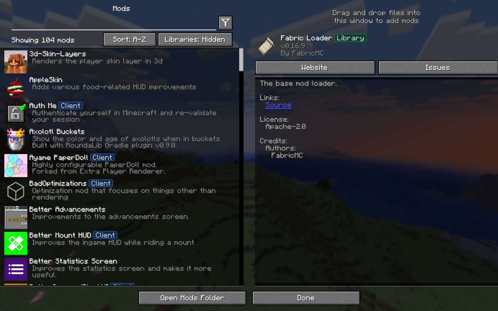

<h3 align="center" >
  

    
    <!--  -->
    
  

   
  
  <h3 align="center">
    Minecraft: <code>Client-Enhanced</code>
  </h3>

  <h6 align="center">
    by nickesc — <a href="https://github.com/nickesc">GitHub</a> | <a href="https://modrinth.com/user/nickesc">Modrinth</a>
      
    
  </h6>
  <h6 align="center">
    a client-side Minecraft modpack that aims 
    to overhaul and modernize the experience
  </h6>
  

    
    <!--  -->
    
    <!--  -->
  

</h3>

## Modpack Overview

`Client-Enhanced` is an overhaul of the current Minecraft client.

Mods like [Camera Overhaul](https://modrinth.com/mod/cameraoverhaul) and
[Shoulder Surfing Reloaded](https://modrinth.com/mod/shoulder-surfing-reloaded)
update the way it feels to move around and the way the camera controls.

And mods like [Sodium](https://modrinth.com/mod/sodium) and
[Lithium](https://modrinth.com/mod/lithium) are used to optimize the experience
for all kinds of hardware.

The pack also includes mods like
[Just Enough Items](https://modrinth.com/mod/jei) and
[JourneyMap](https://modrinth.com/mod/journeymap) that add common-sense UI
elements like item/recipe lookup and a minimap.

Resource packs like [Nautilus 3D](https://modrinth.com/resourcepack/nautilus3d)
and [Fresh Animations](https://modrinth.com/resourcepack/fresh-animations) are
also used to add 3D detail to models and revamp animations.

Shaders like [I Like Vanilla](https://modrinth.com/shader/i-like-vanilla) and
[MakeUp - Ultra Fast](https://modrinth.com/shader/makeup-ultra-fast-shaders) are
able to breath new life into the visuals and make the world look much more
impressive through [Iris](https://modrinth.com/mod/iris) while maintaining
reasonable framerates.

> Click the `.gif` to see shader load-in in realtime and full resolution

> [!CAUTION] `Client-Enhanced` is not necessarily compatible with multiplayer
> servers even though it is client-side only! Some of the mods included may be
> flagged by anti-cheat plugins.
>
> **_DO NOT_** connect to a server while using `Client-Enhanced` unless you know
> that the mods in this modpack are permitted on that server.

#### Other notable features:

- Client side only
- Connect to older Minecraft servers
- Controller support
- Improved player HUD
  - Enemy health bars
  - Block ID for everything you look at
  - A dynamic crosshair
  - More...
- Improved chat UI
- Inventory sorting
- Container previews
- New Statistics and Advancements screens
- Built in resource pack, shader pack and world download browsers
- Updated Elytra flight controls
- A zoom button
- Tweaks to how player animations, skins and capes are rendered
- New particle effects and particle physics
- New sounds and a reworked, more realistic sound engine
- Other fixes and tweaks to controls

See the [Mod List](#mod-list) for a full list of the included mods.

  
<h3> Optional Features </h4>

##### Resource Packs

Included in the resource packs are a number of resource packs that can be
enabled or disabled to your liking. By default, you can find three profiles in
the Resource Pack Browser: `Enhanced` and `Vanilla-Like`, and `Vanilla`.
`Enhanced` includes all recommended packs, while `Vanilla-Like` excludes packs
that change the look too much. `Vanilla` is the default profile and includes
only neccessary packs.

Even within these profiles, there are still some packs that can be chosen
between to fit your needs. To choose between _all_ packs, including packs that
are usually required, you can use the `No Profile` profile.

##### Shaders

There are a lot of different options for shaders in the Shader Pack menu. To
access that menu, press <kbd>O</kbd>. By default, the
[I Like Vanilla](https://modrinth.com/shader/i-like-vanilla) shader is selected,
but there are also options for higher end machines and lower end machines. You
might find the look of the game shifts a little in other dimensions...

##### Hotkeys

Many of the enhancements included in this modpack can be toggled using hotkeys:

- Pressing <kbd>K</kbd> will toggle camera changes, including shaders
- Pressing <kbd>J</kbd> will toggle many HUD elements, including the minimap and
  block ID
- Pressing <kbd>L</kbd> will toggle a couple backend changes like sign
  click-through and some render culling

  
<h3> Keybindings </h4>

## Installation

The `Client-Enhanced` modpack is released on Modrinth and on GitHub.

### Requirements:

- Minecraft 1.21.4
- Java 22+
- the [Modrinth App](https://modrinth.com/app) installed
- macOS **(untested on other platforms)**

### Instructions

#### Install from Modrinth (Recommended)

1. Open the Modrinth App
2. Go to the 'Discover Content' tab in the sidebar
3. Search for `Client-Enhanced` and click the `Install` button
4. Allow the modpack to download
5. Press `Play` to launch Minecraft

#### Install from GitHub (Manual)

1. Open the Modrinth App
2. Download the `Client-Enhanced` `.mrpack` file from the
   [latest Release](https://github.com/nickesc/client-enhanced/releases/latest)
3. Click the `+` icon in the left sidebar to create a new instance
4. Select `Import from file` and open the `.mrpack` file you downloaded
5. Allow the modpack to download
6. Press `Play` to launch Minecraft

<!--
> [!NOTE]
>
> Some settings changed by the user may be overwritten during modpack updates -- make backups of your `options.txt` file and `config/` folder if you want to make sure your settings stay the same as they were before the update.

## Default Keybindings

## Mod List

-->

## Support

